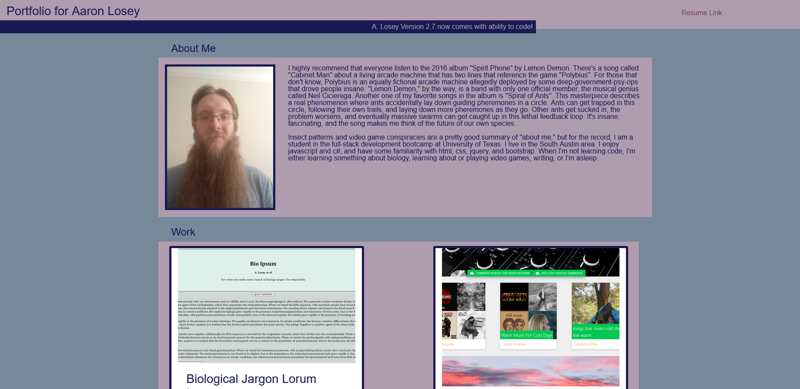

# Advanced-css-homework

Description:
This is the portfolio that I'm maintaining to document my ability as a developer. I starting it during the UT Austin full-stack coding bootcamp program.

Technology used:
html, css, bootstrap

Screenshot:

Deployed page:
[Portfolio](https://ajlosey.github.io/Portfolio/)

Additional notes:
None yet

